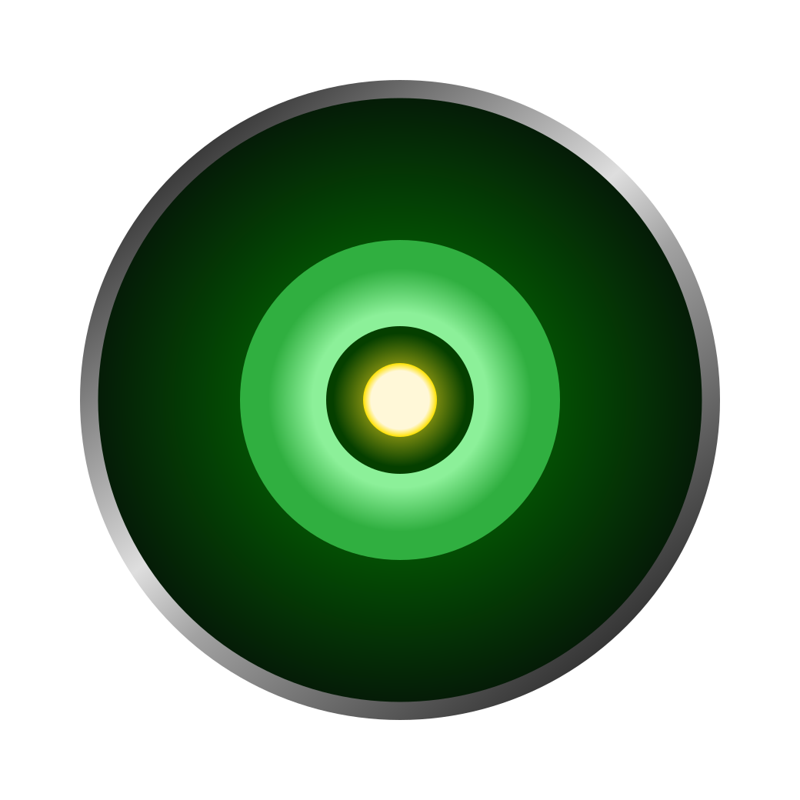

# JADE LENS

  

_**J**enuinely **A**daptive, ri**D**iculously v**E**rsati**LE** i**N**tellect **S**idekick._

A personal AI assistant for daily life — calendar, tasks, projects, notes, plans, research, preferences. The bot organises chaotic natural-language input into structured data and answers questions over it. The UI views and edits that data; the bot is the primary input surface.

See [DESIGN.md](./DESIGN.md) for the architecture.

## License

**Software Code:** The code in this repository is licensed under the [PolyForm Noncommercial License 1.0.0](./LICENSE.md). You are free to read, modify, and use this code for personal or non-commercial purposes. Commercial use is strictly prohibited.

**Branding / Assets:** The logo and associated visual assets (located in `assets/`) are licensed under [Creative Commons Attribution-NonCommercial 4.0 International (CC BY-NC 4.0)](https://creativecommons.org/licenses/by-nc/4.0/). 
